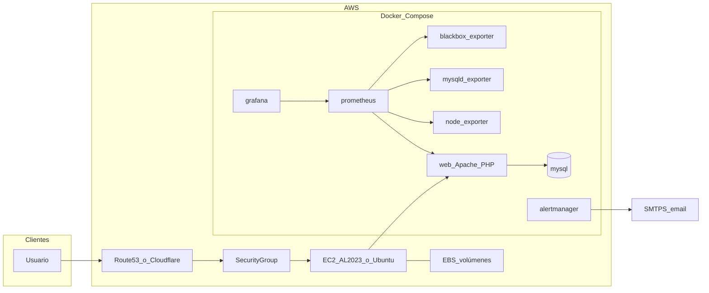

# Despliegue en AWS con Docker

Esta guía describe cómo ejecutar **Taller Mecánico** en **Amazon Web Services** usando **Docker Compose** sobre **EC2**, con opciones de **automatización** mediante **Packer** (AMI base con Docker) y el script [`scripts/deploy_aws_docker.sh`](../scripts/deploy_aws_docker.sh).

> **Importante:** El archivo [`docker-compose.yml`](../docker-compose.yml) del repo está pensado para desarrollo local (monta todo el código en el contenedor y publica muchos puertos). En AWS conviene usar **[`docker-compose.aws.yml`](../docker-compose.aws.yml)**.

## Arquitectura recomendada

Patrón habitual para un proyecto de este tamaño: **una instancia EC2** con **EBS cifrado**, **Docker Compose** levantando aplicación PHP/Apache, MySQL y stack de monitorización. TLS con **Application Load Balancer + ACM**, **Nginx/Caddy/Traefik** en la propia instancia, o **Cloudflare** / **Cloudflare Tunnel** delante.



### Archivos clave del repositorio

| Archivo | Uso |
|--------|-----|
| [`docker-compose.aws.yml`](../docker-compose.aws.yml) | Stack producción en EC2: **full** por defecto (`COMPOSE_PROFILES=monitoring,traffic`): app, MySQL, monitorización (Prometheus, Grafana, Alertmanager, exporters, cAdvisor, Telegraf) y **pruebas de carga** (Apache JMeter + UI en el perfil Docker `traffic`). Grafana/Prometheus/Alertmanager/UI JMeter escuchan en `MONITORING_UI_HOST_BIND=0.0.0.0`; cAdvisor/Telegraf quedan privados en `EXPORTER_HOST_BIND=127.0.0.1`. |
| [`monitoring/prometheus/prometheus.aws.yml`](../monitoring/prometheus/prometheus.aws.yml) | Config Prometheus alineada con el compose AWS (incluye jobs `telegraf` y `cadvisor`). |
| [`.env.aws.example`](../.env.aws.example) | Plantilla full stack; copiar a `.env` y **rotar secretos** (o `SKIP_SECRET_STRICT_CHECK=1` solo en laboratorio). |
| [`packer/aws-docker-ami.pkr.hcl`](../packer/aws-docker-ami.pkr.hcl) | Plantilla Packer para AMI Ubuntu + Docker + Compose plugin. |
| [`scripts/deploy_aws_docker.sh`](../scripts/deploy_aws_docker.sh) | Preflight (paths, disco, RAM+swap vs perfiles), backup opcional, `compose build/up`, comprobación de **todos** los servicios del compose, smoke HTTP y healthchecks en loopback. |
| [`scripts/verify_aws_stack.sh`](../scripts/verify_aws_stack.sh) | Validación estática: `docker compose … config` sin arrancar contenedores. |
| [`scripts/taller-docker-safe-mode.sh`](../scripts/taller-docker-safe-mode.sh) | Usado por `taller-docker-safe-mode.service`: solo actúa si `ALLOW_DEGRADED_STACK=1` en `.env` y la memoria RAM+swap es baja (para contenedores opcionales). |
| [`scripts/ec2-user-data-bootstrap.sh`](../scripts/ec2-user-data-bootstrap.sh) | *User data* EC2 (**Amazon Linux 2023**): instala Docker/Compose/Buildx, clona en `/opt/taller_mecanico_asir`, instala *safe-mode* desde el repo y ejecuta `deploy_aws_docker.sh`. |

## Costes orientativos

Los precios cambian por región y uso; orden de magnitud **solo orientativo**:

| Concepto | Orden de magnitud (USD/mes) |
|----------|------------------------------|
| EC2 `t3.small` / `t3.medium` 24/7 | ~15–35 |
| EBS (gp3, según tamaño) | ~5–20 |
| Elastic IP (si está asociada y la instancia está parada, puede costar) | Revisar política actual de AWS |
| ALB + tráfico (si usas balanceador) | ~20–25 + datos |
| CloudWatch (logs/métricas detalladas) | Variable |
| **Total típico “una EC2 + disco”** | **~20–40** sin ALB; con ALB y logs puede acercarse a **45–70** |

**MySQL en contenedor** es económico y simple; para producción exigente valorar **Amazon RDS** (MySQL) en una iteración posterior (más coste, menos operación de disco/backups a mano).

## Requisitos previos

- Cuenta AWS y permisos para EC2, VPC, IAM (clave SSH o SSM).
- **Par de claves SSH** o acceso **Session Manager** sin SSH clásico.
- En tu máquina: **AWS CLI**, opcionalmente **Packer** si construyes la AMI.
- Dominio (opcional) para HTTPS y correo de alertas.

## Security Group recomendado

Reglas **mínimas** (ajusta IPs):

| Puerto | Origen | Destino |
|--------|--------|---------|
| 22 | Tu IP / bastión | SSH (o cierra SSH y usa SSM) |
| 80 | ALB, Cloudflare o `0.0.0.0/0` si sirves HTTP directo | `web` |
| 443 | Igual | Si terminas TLS en la instancia o proxy |
| 3000 | Tu IP/CIDR (`MONITORING_SG_CIDR`) | Grafana |
| 9090 | Tu IP/CIDR (`MONITORING_SG_CIDR`) | Prometheus |
| 9093 | Tu IP/CIDR (`MONITORING_SG_CIDR`) | Alertmanager |
| 8890 | Tu IP/CIDR (`MONITORING_SG_CIDR`) | UI web para JMeter (perfil `traffic`) |

**No** abras MySQL ni exporters: **3306**, **8080 (cAdvisor)**, **9273 (Telegraf)**, **9100/9104/9115**. Prometheus y Alertmanager no tienen login fuerte por defecto; el script abre puertos UI de forma automática si tiene IAM/`awscli`, pero debes restringir `MONITORING_SG_CIDR` a tu IP/CIDR cuando sea posible.

### Acceso navegador directo

Con el `.env.aws.example`, el despliegue deja las UIs accesibles por IP/DNS público:

- Grafana: `http://IP_PUBLICA:3000`
- Prometheus: `http://IP_PUBLICA:9090`
- Alertmanager: `http://IP_PUBLICA:9093`
- UI JMeter (pruebas de carga): `http://IP_PUBLICA:8890`

`scripts/deploy_aws_docker.sh` imprime estas URLs al final. Si hay permisos IAM, también autoriza reglas del Security Group para `3000`, `9090`, `9093`, `8890` usando `MONITORING_SG_CIDR` (por defecto `0.0.0.0/0` en laboratorio). El puerto `8890` solo aplica si activas el perfil `traffic` (JMeter + UI).

### Pruebas de carga (Apache JMeter) en EC2

**Guía para operadores (interfaz, controles, variables):** [GUIA_JMETER_USUARIO.md](GUIA_JMETER_USUARIO.md) — incluye apartado específico EC2. **Referencia técnica** (API `:8085`, CLI, volúmenes): [TRAFFIC_SIMULATOR.md](TRAFFIC_SIMULATOR.md).

| Paso | Acción |
|------|--------|
| 1 | Asegúrate de que `COMPOSE_PROFILES` incluye `traffic` (por defecto en [`.env.aws.example`](../.env.aws.example)) y que el Security Group permite **8890** desde tu IP. |
| 2 | Tras `./scripts/deploy_aws_docker.sh`, abre la **Traffic UI** (`TRAFFIC_SIMULATOR_UI_EXTERNAL_URL` o `http://IP_PUBLICA:8890`). El script también imprime la guía de consola vía `print-jmeter-usage.sh`. |
| 3 | En la UI, **URL base** recomendada: `http://web` (mismo nombre de servicio que en local; golpea la app por la red Docker interna). Alternativa: `http://IP_PUBLICA/` si quieres simular clientes externos. |
| 4 | Configura perfil, usuarios y duración → **Iniciar prueba**. Revisa el panel de resultados y, si `monitoring` está activo, Grafana (fila **Simulador**, `source=simulator`). |
| 5 | Rota `SIMULATOR_CONTROL_TOKEN` en `.env` si el bootstrap generó uno nuevo; no dejes placeholders `CAMBIAR_*` en producción. |

Variables EC2 relevantes (ver también la guía de usuario): `TRAFFIC_SIMULATOR_UI_HOST_PORT`, `TRAFFIC_SIMULATOR_UI_EXTERNAL_URL`, `SIMULATOR_CONTROL_TOKEN`, `SIM_UI_DEFAULT_BASE_URL`, `SIM_UI_PUBLIC_APP_URL` (preset app pública en la UI; la fijan deploy y bootstrap), `SIM_JMETER_HEAP`, `TRAFFIC_SIMULATOR_MEM_LIMIT`, `SKIP_TRAFFIC_SMOKE=1` (omitir smoke al desplegar), `MIN_TRAFFIC_STACK_MEM_MB` (preflight de memoria).

**URL pública de Alertmanager (UI):** `deploy_aws_docker.sh` y [`ec2-user-data-bootstrap.sh`](../scripts/ec2-user-data-bootstrap.sh) escriben `ALERTMANAGER_EXTERNAL_URL=http://<host>:<ALERTMANAGER_HOST_PORT>` en `.env`, donde `<host>` es `PUBLIC_ACCESS_HOST` si lo defines, o la **IPv4 pública** de la instancia vía metadata EC2 (y, si no hay IPv4, el public hostname). El contenedor pasa esa URL a Alertmanager como `--web.external-url` (en [`monitoring/alertmanager/alertmanager-entrypoint.sh`](../monitoring/alertmanager/alertmanager-entrypoint.sh)) para que enlaces y rutas de la UI coincidan con el acceso real. Si Alertmanager va detrás de un proxy con prefijo de ruta, define `ALERTMANAGER_ROUTE_PREFIX` (por defecto `/`).

## Despliegue manual en EC2

### Opción A — Amazon Linux 2023 (recomendada para [`ec2-user-data-bootstrap.sh`](../scripts/ec2-user-data-bootstrap.sh))

1. **AMI:** última **Amazon Linux 2023** (p. ej. kernel 6.1 en la familia `al2023-ami-*`).
2. **Tipo / disco / SG / IAM:** igual que en la opción Ubuntu más abajo.
3. **User data:** pega el contenido de [`scripts/ec2-user-data-bootstrap.sh`](../scripts/ec2-user-data-bootstrap.sh) en *Advanced details* → *User data* ([documentación EC2](https://docs.aws.amazon.com/AWSEC2/latest/UserGuide/user-data.html)). Debe empezar por `#!/bin/bash`; usa texto plano salvo que codifiques tú en Base64 el script completo.

**Importante:** cloud-init ejecuta solo ese fichero como `part-001`; **no** copia la carpeta `scripts/lib/` junto al script. El bootstrap carga los helpers (`bootstrap-lib-loader.sh`, `install-progreso-docker.fn.sh`, `docker-bootstrap-plugins.sh`, etc.) desde el checkout local (si pruebas en el repo) o con `curl` desde `raw.githubusercontent.com` según `REPO_URL` y `GIT_REF`. Tras cambiar el bootstrap en el repo, **vuelve a pegar** el user data actualizado en la consola o lanza una instancia nueva; el fallback remoto requiere que esos ficheros existan en la rama `GIT_REF` del remoto (p. ej. `main` en GitHub).

El script replica los pasos oficiales de AWS para instalar Docker en AL2023 ([*Installing Docker on AL2023*](https://docs.aws.amazon.com/AmazonECS/latest/developerguide/docker-basics.html#create-container-image-install-docker)): `dnf update -y`, `dnf install docker`, arranque del servicio y `ec2-user` en el grupo `docker`. Además instala `httpd` como fallback operativo, pero lo deja **parado y deshabilitado** para que no ocupe el puerto `80` que publica Docker (`web`). Los paquetes `docker`/`containerd` están en los repositorios principales de AL2023 ([notas AL2023 / ECS](https://docs.aws.amazon.com/linux/al2023/ug/ecs.html)). **Docker Compose V2** no forma parte de ese snippet de ECS; el bootstrap intenta `docker-compose-plugin` por `dnf` y, si no basta, instala el plugin según [Compose — instalación manual del plugin](https://docs.docker.com/compose/install/linux/#install-the-plugin-manually). En los repos por defecto de AL2023 **no** existe el RPM homónimo de Docker CE `docker-buildx-plugin` (nombre habitual en Ubuntu / repo oficial de Docker); el paquete `docker` ya incluye un Buildx embebido que a menudo es **anterior a 0.17**, mientras que Compose reciente exige Buildx ≥ 0.17 ([discusión AL2023 / compatibilidad compose–buildx](https://github.com/amazonlinux/amazon-linux-2023/issues/1032)). El *user data* solo intenta `dnf install docker-buildx-plugin` si `dnf list` lo ve disponible; si no, puede ejecutar `dnf upgrade docker` y, si aún no basta, descarga el binario del plugin desde los *releases* de [buildx](https://github.com/docker/buildx/releases) a `/usr/libexec/docker/cli-plugins/docker-buildx`.

Log del arranque: `/var/log/taller-ec2-bootstrap.log`. Tras entrar por SSH, escribe el comando **`progreso_docker`** (instalado en `/usr/local/bin` por el bootstrap) para ver el log en vivo y un resumen de `docker ps -a`. **Ctrl+C** para volver al shell. El script escribe bloques `taller-bootstrap: Paso X/9 - …` con marca temporal UTC. En instancias ya creadas sin el comando: `sudo bash /opt/taller_mecanico_asir/scripts/install-progreso-docker.sh`. Equivalente manual: `sudo tail -f /var/log/taller-ec2-bootstrap.log`. Al terminar el despliegue, el bootstrap y [`deploy_aws_docker.sh`](../scripts/deploy_aws_docker.sh) listan también **`docker ps -a`**. Si el bootstrap crea `.env` desde `.env.aws.example` o detecta secretos placeholder, reemplaza automáticamente `MYSQL_PASSWORD`, `MYSQL_ROOT_PASSWORD`, `GRAFANA_ADMIN_PASSWORD` y `SIMULATOR_CONTROL_TOKEN` con valores aleatorios antes del despliegue. **Tras el primer arranque**, revisa/rota secretos en `.env` según tu política. El despliegue manual **falla** si quedan placeholders `CAMBIAR_*` o token `changeme` con perfil `traffic`, salvo `SKIP_SECRET_STRICT_CHECK=1` en laboratorio.

En el **primer arranque por user data**, el bootstrap exporta `SKIP_TRAFFIC_SMOKE=1` (por defecto) y timeouts más largos (`STACK_VERIFY_TIMEOUT_SEC`, `COMPOSE_UP_WAIT_TIMEOUT`, etc.) para instancias pequeñas (p. ej. t3.small). Así el paso 9 no falla por el smoke JMeter corto mientras aún arrancan los contenedores. Para validar JMeter tras estabilizar el stack: `SKIP_TRAFFIC_SMOKE=0 SKIP_BACKUP=1 ./scripts/deploy_aws_docker.sh`. Puedes forzar el smoke en el primer boot exportando `SKIP_TRAFFIC_SMOKE=0` en el user data.

Validación local sin levantar contenedores: `DEPLOY_PREFLIGHT_ONLY=1 bash scripts/deploy_aws_docker.sh` (comprueba rutas, memoria/disco y `docker compose config`). Tests unitarios de helpers `.env`: `bash tests/test_aws_deploy_env.sh`. Tests de carga de libs del bootstrap (URL raw / cloud-init): `bash tests/test_bootstrap_lib_loader.sh`. Comprobación de libs en GitHub `main` (avisa si falta push): `bash tests/test_ec2_cloud_init_lib_load.sh`. Tests de helpers del bootstrap Docker (Buildx / `dnf`): `bash tests/test_docker_bootstrap_plugins.sh`.

El bootstrap usa **reintentos** en `dnf`/`curl`, crea o agranda **swap persistente** (`SWAP_SIZE_GB=4` por defecto), comprueba `docker` / `docker compose` / `docker buildx` tras instalar plugins y, si el despliegue falla, deja en el log un volcado de `docker compose ps -a` y logs de **todos** los servicios del compose. Instala `taller-docker-safe-mode.service` desde [`scripts/taller-docker-safe-mode.sh`](../scripts/taller-docker-safe-mode.sh): **no para contenedores** salvo que en `.env` tengas `ALLOW_DEGRADED_STACK=1` y la instancia tenga poca memoria RAM+swap (modo degradado explícito). Puedes fijar versiones de fallback (si no basta el paquete `docker-compose-plugin` de AL2023) exportando antes del user data: `DOCKER_COMPOSE_VERSION` (por defecto `latest`, descarga el último release de Compose) y `DOCKER_BUILDX_VERSION` (por defecto `v0.19.3`).

**Si instalas a mano** (sin user data), equivalente al documento AWS:

```bash
sudo dnf update -y
sudo dnf install -y docker httpd
sudo systemctl disable --now httpd # instalado por si acaso; Docker web usa el puerto 80
sudo systemctl enable --now docker
sudo usermod -a -G docker ec2-user
# nueva sesión SSH para aplicar el grupo salvo que uses root para compose
```

### Opción B — Ubuntu 22.04 LTS

#### 1) Lanzar la instancia

- AMI: **Ubuntu Server 22.04 LTS** (o la AMI generada con Packer para Ubuntu).
- Tipo: al menos **t3.small** si incluyes monitorización completa (Prometheus/Grafana); **t3.medium** con más holgura.
- Disco raíz: **gp3**, tamaño acorde (p. ej. 30–50 GiB iniciales).
- **EBS cifrado** activado.
- Asociar **rol IAM** si usarás SSM, backups S3, etc.

En Ubuntu puedes automatizar con tu propio user data o seguir los pasos manuales siguientes (no uses el bootstrap de AL2023 tal cual: está pensado para `dnf`/Amazon Linux).

#### 2) Instalar Docker (si la AMI no lo trae)

```bash
# Documentación Docker para Ubuntu, o AMI construida con Packer
sudo apt-get update
sudo apt-get install -y ca-certificates curl gnupg
sudo install -m 0755 -d /etc/apt/keyrings
curl -fsSL https://download.docker.com/linux/ubuntu/gpg | sudo gpg --dearmor -o /etc/apt/keyrings/docker.gpg
echo "deb [arch=$(dpkg --print-architecture) signed-by=/etc/apt/keyrings/docker.gpg] https://download.docker.com/linux/ubuntu $(. /etc/os-release && echo \"$VERSION_CODENAME\") stable" | sudo tee /etc/apt/sources.list.d/docker.list > /dev/null
sudo apt-get update
sudo apt-get install -y docker-ce docker-ce-cli containerd.io docker-buildx-plugin docker-compose-plugin
sudo usermod -aG docker "$USER"
# cerrar sesión y volver a entrar para grupo docker
```

#### 3) Clonar el repositorio

```bash
sudo mkdir -p /opt/taller_mecanico_asir
sudo chown "$USER:$USER" /opt/taller_mecanico_asir
cd /opt/taller_mecanico_asir
git clone <URL_DE_TU_REPO> .
```

#### 4) Variables de entorno

```bash
cp .env.aws.example .env
nano .env   # o vim; rotar TODAS las contraseñas y tokens
```

Comprueba al menos:

- `MYSQL_ROOT_PASSWORD`, `MYSQL_PASSWORD`, `MYSQL_USER`, `MYSQL_DATABASE`
- `GRAFANA_ADMIN_PASSWORD`
- `SIMULATOR_CONTROL_TOKEN` (obligatorio con perfil `traffic`; no uses valores por defecto en producción)
- `APP_ENV=production`, `APP_DEBUG=false`
- `DEPLOY_MONITORING=1` y `COMPOSE_PROFILES=monitoring,traffic` (**full stack** por defecto en `.env.aws.example`). Ajusta `MIN_MONITORING_MEM_MB` / `MIN_TRAFFIC_STACK_MEM_MB` o usa `FORCE_MONITORING_ON_LOW_MEM=1` / `ALLOW_DEGRADED_STACK=1` según memoria RAM+swap (recomendado **t3.medium+** o al menos ~4 GiB RAM+swap; el bootstrap crea 4 GiB de swap por defecto).
- Para **solo** `web` + `mysql`: deja `COMPOSE_PROFILES` vacío y `DEPLOY_MONITORING=0`.
- SMTP para Alertmanager si quieres correos (`SMTP_*`, `ALERT_EMAIL_TO`). Para Amazon SES puedes definir `SES_SMTP_REGION` y dejar `SMTP_SMARTHOST` vacío: los scripts rellenan `email-smtp.<region>.amazonaws.com:587`. Si **no** configuras correo todavía, deja `ALERT_EMAIL_TO` vacío: el entrypoint de Alertmanager usa una config **noop** válida hasta que completes SMTP.
- URLs públicas de UIs (`PROMETHEUS_EXTERNAL_URL`, `GRAFANA_EXTERNAL_URL`, `ALERTMANAGER_EXTERNAL_URL`, `TRAFFIC_SIMULATOR_UI_EXTERNAL_URL`): el script de despliegue las actualiza con metadata EC2 (IPv4 primero) si no fijas `PUBLIC_ACCESS_HOST`. El dashboard Grafana se parchea con [`tools/patch_grafana_public_urls.py`](../tools/patch_grafana_public_urls.py) (enlaces Prometheus, Alertmanager, Test Email y simulador).

#### 4b) Alertmanager con Amazon SES SMTP

El flujo de alertas es: Prometheus evalúa [`monitoring/prometheus/alerts.yml`](../monitoring/prometheus/alerts.yml), envía las alertas a `alertmanager:9093` según [`monitoring/prometheus/prometheus.aws.yml`](../monitoring/prometheus/prometheus.aws.yml), y Alertmanager genera emails con la plantilla [`monitoring/alertmanager/alertmanager.yml`](../monitoring/alertmanager/alertmanager.yml). El contenedor usa [`monitoring/alertmanager/alertmanager-entrypoint.sh`](../monitoring/alertmanager/alertmanager-entrypoint.sh): si faltan `ALERT_EMAIL_TO`, `SMTP_SMARTHOST` o `SMTP_FROM`, arranca en modo **noop** para no romper el despliegue; cuando están completos, sustituye los placeholders `__SMTP_*__` y envía por SMTP. En EC2, si `ALERTMANAGER_EXTERNAL_URL` está definido (lo normal tras `deploy_aws_docker.sh`), Alertmanager arranca con `--web.external-url` y `--web.route-prefix` (`ALERTMANAGER_ROUTE_PREFIX`, por defecto `/`) para que la UI no genere enlaces incorrectos al acceder por `http://IP:9093`.

Para usar Amazon SES:

1. En la consola de **Amazon SES**, elige la región desde la que vas a enviar. El endpoint SMTP tiene formato `email-smtp.<region>.amazonaws.com`.
2. Verifica una identidad de envío: email o dominio. `SMTP_FROM` debe ser una identidad verificada en esa región.
3. Si la cuenta está en **sandbox**, verifica también todos los destinatarios de `ALERT_EMAIL_TO` o solicita acceso a producción en SES.
4. En **SES → SMTP settings**, crea credenciales SMTP. Usa esos valores en `SMTP_AUTH_USERNAME` y `SMTP_AUTH_PASSWORD`; no uses Access Keys IAM normales.
5. Edita `.env` en el servidor:

```bash
ALERT_EMAIL_TO=destino@example.com
SES_SMTP_REGION=eu-west-1
SMTP_SMARTHOST=
SMTP_FROM=monitoring@example.com
SMTP_AUTH_USERNAME=TU_USUARIO_SMTP_SES
SMTP_AUTH_PASSWORD=TU_PASSWORD_SMTP_SES
SMTP_REQUIRE_TLS=true
```

También puedes omitir `SES_SMTP_REGION` y fijar `SMTP_SMARTHOST` directamente:

```bash
SMTP_SMARTHOST=email-smtp.eu-west-1.amazonaws.com:587
```

Aplica cambios:

```bash
cd /opt/taller_mecanico_asir
./scripts/deploy_aws_docker.sh
# o solo reinicia Alertmanager si no cambiaste nada mas:
docker compose --env-file .env -f docker-compose.aws.yml up -d alertmanager
```

Prueba y diagnóstico:

```bash
docker compose --env-file .env -f docker-compose.aws.yml logs --tail 120 alertmanager
curl -sf http://127.0.0.1:9093/-/healthy
curl -sf http://127.0.0.1:9093/ | head -c 400
# La página debe contener "Alertmanager"; no debe ser el índice PHP del taller (puerto WEB_HOST_PORT, por defecto 80).
```

Errores habituales:

| Síntoma | Causa probable |
|---------|----------------|
| `554 Message rejected: Email address is not verified` | `SMTP_FROM` o destinatario no verificado, o SES sigue en sandbox. |
| `535 Authentication Credentials Invalid` | Credenciales SMTP de SES incorrectas, región equivocada o se usaron Access Keys IAM normales. |
| No llegan correos pero Alertmanager está sano | Revisa sandbox, límites SES, carpeta spam, `SMTP_FROM`, `ALERT_EMAIL_TO` y logs del contenedor. |
| TLS/handshake falla | Usa puerto `587` y `SMTP_REQUIRE_TLS=true`; confirma que el SG/NACL permite salida TCP/587. |

#### UI de Alertmanager y email de prueba

La interfaz web de Alertmanager **no** incluye un botón para enviar un correo de prueba (comportamiento estándar upstream). Para validar correo: usa el panel admin [`admin/test-alert-email.php`](../admin/test-alert-email.php) (tras iniciar sesión) o un POST a `http://127.0.0.1:9093/api/v2/alerts` desde la instancia; detalle en [`docs/MONITORING_SETUP_GUIDE.md`](MONITORING_SETUP_GUIDE.md).

#### 4c) Validación estática (opcional)

```bash
chmod +x scripts/verify_aws_stack.sh
./scripts/verify_aws_stack.sh
# o con un .env concreto:
ENV_FILE=.env ./scripts/verify_aws_stack.sh
```

#### 5) Levantar el stack

```bash
./scripts/deploy_aws_docker.sh
docker compose -f docker-compose.aws.yml ps
```

La aplicación queda en el puerto configurado (`WEB_HOST_PORT`, por defecto **80**). Con el `.env.aws.example` actual, el stack **full** arranca monitorización y el perfil `traffic` (JMeter + UI); Prometheus, Grafana, Alertmanager y la UI en `:8890` quedan accesibles en navegador por IP pública si el Security Group lo permite. cAdvisor y Telegraf siguen privados. Para un stack mínimo solo app + MySQL, vacía `COMPOSE_PROFILES` y pon `DEPLOY_MONITORING=0`.

### Verificación y Grafana (tras Opción A con user data o tras Opción B §5)

#### Comprobaciones HTTP en la instancia

```bash
curl -sf http://127.0.0.1/ | head
# Con perfiles monitoring:
curl -sf http://127.0.0.1:9090/-/healthy
curl -sf http://127.0.0.1:3000/api/health
curl -sf http://127.0.0.1:9093/-/healthy
curl -sf http://127.0.0.1:9093/ | grep -qi Alertmanager && echo OK_alertmanager_ui
# Con perfil traffic (UI + worker JMeter, puerto TRAFFIC_SIMULATOR_UI_HOST_PORT):
curl -sf http://127.0.0.1:8890/health.php
```

(Desde fuera: `http://IP_PUBLICA/`, `http://IP_PUBLICA:3000`, `http://IP_PUBLICA:9090`, `http://IP_PUBLICA:9093`, `http://IP_PUBLICA:8890` si el SG lo permite.)

## HTTPS y dominio

El repo no fija un único método; opciones habituales:

1. **ALB + ACM**: certificado en el balanceador, objetivo instancia en 80 o 443.
2. **Nginx/Caddy** en EC2 con Let’s Encrypt (puertos 80/443 en SG).
3. **Cloudflare** delante (proxy naranja) + origen HTTP interno.
4. **Cloudflare Tunnel** (`cloudflared`) si no quieres abrir 80/443 (similar a comentarios en `docker-compose.dokploy.yml`).

Ajusta [`monitoring/prometheus/blackbox.yml`](../monitoring/prometheus/blackbox.yml) y URLs externas si pasas de HTTP interno a **HTTPS público** en probes sintéticos.

## Automatización con Packer (AMI con Docker)

Plantilla: [`packer/aws-docker-ami.pkr.hcl`](../packer/aws-docker-ami.pkr.hcl).

```bash
cd packer
packer init aws-docker-ami.pkr.hcl
packer validate aws-docker-ami.pkr.hcl
packer build aws-docker-ami.pkr.hcl
```

Requiere credenciales AWS (`AWS_ACCESS_KEY_ID` / `AWS_SECRET_ACCESS_KEY` o perfil) y región (variable `region`, por defecto `eu-west-1`). La AMI **no** incluye el proyecto ni secretos: solo Docker para arrancar más rápido.

Tras el build, crea una instancia desde esa AMI y continúa en “Clonar el repositorio” arriba.

## Automatización de despliegue / actualización

Script: [`scripts/deploy_aws_docker.sh`](../scripts/deploy_aws_docker.sh).

```bash
chmod +x scripts/deploy_aws_docker.sh
./scripts/deploy_aws_docker.sh
```

Comportamiento:

- **Preflight**: existencia de ficheros montados (`database/`, `monitoring/` y runner JMeter), espacio libre (`MIN_FREE_DISK_MB`, por defecto 2 GiB), memoria RAM+swap vs perfiles (`MIN_MONITORING_MEM_MB`, `MIN_TRAFFIC_STACK_MEM_MB`) — **falla** si no hay recursos salvo `FORCE_MONITORING_ON_LOW_MEM=1` o `ALLOW_DEGRADED_STACK=1` (este último reduce el stack a solo `web`+`mysql`).
- **Secretos**: rechaza placeholders `CAMBIAR_*`, defaults débiles (`rootpassword`, `app_password`, `admin123`) y tokens `changeme` con perfil `traffic`, salvo `SKIP_SECRET_STRICT_CHECK=1`.
- Si ya existe el servicio `mysql`, intenta **backup** (`mysqldump` comprimido en `backups/`).
- `docker compose config` (validación), `build`, `pull`, `up -d` (con `--wait` si el cliente lo soporta).
- Tras el `up`, comprueba que **todos** los servicios del compose están en ejecución (y `healthy` si tienen healthcheck); smoke `GET /`, Prometheus, Grafana, Alertmanager, `/health.php` de la UI de tráfico y una ejecución corta de Apache JMeter contra `http://web` cuando los perfiles lo exigen.
- Al final imprime **`docker ps -a`** (además de `docker compose ps -a`) para una vista global de contenedores en el host.

Variables útiles:

- `SKIP_BACKUP=1` — omitir backup (primer despliegue o mantenimiento).
- `COMPOSE_FILE=docker-compose.aws.yml` — por defecto ya es este archivo.
- `PROJECT_DIR` — raíz del repo si ejecutas desde otro directorio.
- `DEPLOY_MONITORING=1` — añade el perfil `monitoring` si faltaba en `COMPOSE_PROFILES`.
- `COMPOSE_PROFILES=monitoring,traffic` — stack completo (por defecto en `.env.aws.example`).
- `MIN_MONITORING_MEM_MB`, `MIN_TRAFFIC_STACK_MEM_MB`, `MIN_FREE_DISK_MB` — umbrales de preflight (`3200`, `4200` y `2048` MB por defecto).
- `JMETER_VERSION`, `SIM_JMETER_HEAP`, `SIM_JMETER_WORK_DIR`, `SIM_JMETER_HTML_REPORT` — versión, tuning y reporte del worker Apache JMeter (`5.6.3`, `-Xms128m -Xmx256m -XX:MaxMetaspaceSize=128m`, `/var/www/html/logs/jmeter`, `true` por defecto). La **UI JMeter** enlaza el dashboard HTML de JMeter al finalizar cada ejecución. Tabla completa para operadores: [GUIA_JMETER_USUARIO.md § Variables](GUIA_JMETER_USUARIO.md#5-variables-de-configuración-env).
- `SKIP_TRAFFIC_SMOKE=1` — omite el smoke JMeter del despliegue si necesitas desplegar sin generar tráfico sintético.
- `FORCE_MONITORING_ON_LOW_MEM=1` — omite el fallo por memoria RAM+swap baja (riesgo de OOM).
- `ALLOW_DEGRADED_STACK=1` — si la memoria RAM+swap es baja, despliega solo `web`+`mysql` en lugar de fallar.
- `STACK_VERIFY_TIMEOUT_SEC` — tiempo máximo esperando servicios sanos (por defecto 420).
- `COMPOSE_BUILD_PARALLEL=1` — build paralelo (no recomendado en instancias pequeñas).

El script **no** hace `source .env` (evita romper contraseñas con `$`, `#`, espacios, etc.): pasa variables a Compose con `--env-file .env` cuando existe. Puertos para las comprobaciones (`WEB_HOST_PORT`, `PROMETHEUS_HOST_PORT`, etc.) se leen del mismo fichero sin evaluarlo como shell.

### Redespliegue manual por SSH

Para actualizar la instancia, entra por SSH, ve a la ruta del clon (por defecto `/opt/taller_mecanico_asir`), trae la rama deseada con `git pull --ff-only` y ejecuta [`scripts/deploy_aws_docker.sh`](../scripts/deploy_aws_docker.sh).

```bash
cd /opt/taller_mecanico_asir
git pull --ff-only
./scripts/deploy_aws_docker.sh
```

Antes de desplegar, valida que el PEM, usuario, puerto e IP realmente conectan con la EC2:

```powershell
ssh -i "C:\ruta\a\clave.pem" -p 22 -o BatchMode=yes -o ConnectTimeout=10 ec2-user@IP_O_HOST_EC2 "echo ok"
```

Notas de seguridad y operación:

- No commitees el `.pem`, `.env` reales ni salidas que contengan secretos.
- Si el PEM se expone fuera de un almacén seguro, rota el key pair/usuario de despliegue.
- Si falla con `Permission denied (publickey)`, revisa usuario SSH, clave privada, puerto SSH y reglas del Security Group.
- Si falla en `git pull --ff-only`, resuelve cambios locales en `/opt/taller_mecanico_asir` antes de relanzar.

Requisitos en el servidor: ruta fija `/opt/taller_mecanico_asir` (como en [`ec2-user-data-bootstrap.sh`](../scripts/ec2-user-data-bootstrap.sh)), acceso `git` al remoto (repo público o credenciales ya configuradas en el host) y que el usuario SSH pueda ejecutar Docker (grupo `docker` o uso de `sudo` si adaptas el script).

### Modo anti-colapso / recovery

Si la instancia se queda inaccesible tras levantar el stack completo, usa SSM/SSH cuando vuelva a responder. Opciones:

```bash
# Opcion A: poner ALLOW_DEGRADED_STACK=1 en .env y reiniciar el servicio safe-mode (o ejecutarlo a mano):
sudo sed -i 's/^ALLOW_DEGRADED_STACK=.*/ALLOW_DEGRADED_STACK=1/' /opt/taller_mecanico_asir/.env
sudo /usr/local/sbin/taller-docker-safe-mode
cd /opt/taller_mecanico_asir
# Opcion B: editar .env (COMPOSE_PROFILES vacio, DEPLOY_MONITORING=0) y reaplicar:
sudo docker compose --env-file .env -f docker-compose.aws.yml up -d --remove-orphans
```

En nuevos despliegues, el bootstrap deja **swap** persistente y habilita `taller-docker-safe-mode.service`, que ejecuta [`scripts/taller-docker-safe-mode.sh`](../scripts/taller-docker-safe-mode.sh) al arrancar: **no altera contenedores** salvo que `ALLOW_DEGRADED_STACK=1` en `.env` y la memoria RAM+swap sea inferior a `MIN_MONITORING_MEM_MB`.

## Persistencia y copias de seguridad

Volúmenes Docker nombrados en el compose: datos de MySQL, Prometheus, Grafana, Alertmanager, imágenes subidas, logs y caché de la app.

Recomendado además:

- **Snapshots EBS** programados (Lifecycle Manager).
- Copiar `backups/*.sql.gz` a **S3** con cifrado y política de retención.
- Restauración: detener tráfico, restaurar volúmen o importar SQL en `mysql`.

Puedes usar también [`docker/backup.sh`](../docker/backup.sh) montando credenciales si ejecutas un contenedor one-off; el script de despliegue ya cubre el caso más común en EC2.

## Seguridad operativa

- Rotar credenciales por defecto de [`.env.example`](../.env.example); nunca subir `.env` real al Git (está en `.gitignore`).
- Endpoint [`/metrics.php`](../monitoring/php-exporter/metrics.php): tratar como **interno**; en este compose Prometheus scrapea por red Docker; no hace falta publicar métricas al Internet.
- **Pruebas de carga (perfil `traffic` en [`docker-compose.aws.yml`](../docker-compose.aws.yml)):** la UI JMeter se publica en el puerto configurado (p. ej. `8890`) según `MONITORING_UI_HOST_BIND`. Restringe acceso en el Security Group y rota `SIMULATOR_CONTROL_TOKEN`. Procedimiento de uso: [GUIA_JMETER_USUARIO.md](GUIA_JMETER_USUARIO.md).
- El exporter MySQL en [`docker-compose.aws.yml`](../docker-compose.aws.yml) usa **`MYSQL_USER` / `MYSQL_PASSWORD`** alineados con el usuario de aplicación (evita el fallo típico `root` + contraseña de `app_user`).

## Incidencias frecuentes

| Síntoma | Comprobación |
|---------|----------------|
| 502 / sin respuesta | `docker compose -f docker-compose.aws.yml logs web`; SG permite puerto 80/443. |
| Prometheus “down” para algún target | `docker compose logs prometheus`; revisar que los nombres de servicio coinciden con `prometheus.aws.yml`. |
| Grafana inaccesible desde fuera | Con `MONITORING_UI_HOST_BIND=127.0.0.1` es **normal** (solo loopback): usa túnel SSH o proxy. Con `0.0.0.0` (p. ej. `.env.aws.example`) comprueba que el Security Group permita `3000` desde tu IP/CIDR. |
| `compose build requires buildx 0.17.0 or later` (AL2023) | El RPM `docker` puede traer Buildx antiguo. Instala plugin ≥ 0.17, p. ej. `curl` del release [buildx](https://github.com/docker/buildx/releases) a `/usr/libexec/docker/cli-plugins/docker-buildx` + `chmod +x`; el bootstrap ya fuerza Buildx reciente. Luego `SKIP_BACKUP=1 ./scripts/deploy_aws_docker.sh`. |
| Alertmanager cae al arrancar / Prometheus no levanta | Comprueba montaje en [`docker-compose.aws.yml`](../docker-compose.aws.yml) (`alertmanager.yml` → `/etc/alertmanager/config/alertmanager.yml`) y logs: `docker compose logs alertmanager`. Sin correo configurado debe usarse config noop (entrypoint). |
| `missing to address in email config` (Alertmanager) | Rellena `ALERT_EMAIL_TO` **y** como mínimo `SMTP_SMARTHOST` y `SMTP_FROM`, o deja correo vacío para modo noop hasta configurar SMTP. |
| SES no envia email | Verifica identidad `SMTP_FROM`, destinatarios si SES esta en sandbox, credenciales SMTP de SES y endpoint `email-smtp.<region>.amazonaws.com:587`. |
| Fallos raros al cargar `.env` en el despliegue | No edites `.env` con sintaxis rara en una sola línea; `deploy_aws_docker.sh` ya no hace `source .env`. Usa `docker compose ... --env-file .env` explícitamente si llamas a Compose a mano. |
| `permission denied` al conectar a `/var/run/docker.sock` como `ec2-user` | Tras `usermod -a -G docker`, la sesión SSH **abierta** no recibe el grupo hasta **nueva conexión SSH** o `newgrp docker`. Comprueba `groups`. Temporalmente: `sudo docker ps`. ([Guía AWS — mismo aviso tras añadir el usuario al grupo `docker`](https://docs.aws.amazon.com/AmazonECS/latest/developerguide/docker-basics.html#create-container-image-install-docker).) |
| Traffic UI / JMeter no abre desde el navegador | SG permite `8890` desde tu IP; `COMPOSE_PROFILES` incluye `traffic`; `curl -sf http://127.0.0.1:8890/health.php` en la instancia. Ver [GUIA_JMETER_USUARIO.md](GUIA_JMETER_USUARIO.md). |
| Despliegue falla por memoria con perfil `traffic` | RAM+swap &lt; `MIN_TRAFFIC_STACK_MEM_MB` (4200 por defecto): instancia mayor, más swap, `FORCE_MONITORING_ON_LOW_MEM=1`, o `ALLOW_DEGRADED_STACK=1` (solo `web`+`mysql`). |
| Smoke JMeter del deploy falla | Token `SIMULATOR_CONTROL_TOKEN` coherente en `.env`; `docker compose logs traffic-simulator`; volumen `./logs` montado en `web` y worker. `SKIP_TRAFFIC_SMOKE=1` para omitir (valor por defecto en el primer user data). |
| Bootstrap paso 9 falla en t3.small | Revisa `/var/log/taller-ec2-bootstrap.log`; confirma que `main` en GitHub incluye estos scripts; aumenta swap o usa `SKIP_TRAFFIC_SMOKE=1` (ya por defecto en bootstrap). |
| Prueba en marcha pero 0 requests en la UI | URL base desde el contenedor: usa `http://web`, no `http://localhost:…` del host. Ver [GUIA_JMETER_USUARIO.md § Errores](GUIA_JMETER_USUARIO.md#6-buenas-prácticas-y-errores-frecuentes). |

## Evolución recomendada

- **RDS MySQL** (o Aurora compatible MySQL) + cambiar `DB_HOST` / variables según endpoint gestionado (véase alias en [`config/database.php`](../config/database.php)).
- **Separar monitorización** en otra instancia o servicio gestionado para reducir carga en la app.
- **Despliegue gestionado**: si necesitas automatizar releases, valora CodeDeploy, SSM Run Command o un servicio de orquestación interno.

## Referencias cruzadas

- Despliegue Docker genérico: [DOCKER_DEPLOYMENT.md](DOCKER_DEPLOYMENT.md)
- Pruebas de carga JMeter (usuario): [GUIA_JMETER_USUARIO.md](GUIA_JMETER_USUARIO.md)
- Pruebas de carga JMeter (técnico): [TRAFFIC_SIMULATOR.md](TRAFFIC_SIMULATOR.md)
- Monitorización: [MONITORING_SETUP_GUIDE.md](MONITORING_SETUP_GUIDE.md)
