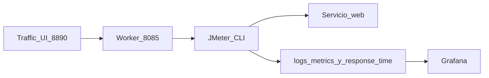

# Guía de usuario — Pruebas de carga con Apache JMeter

Esta guía está pensada para **operadores nuevos** que van a lanzar su primera prueba de carga contra el Taller Mecánico. Explica qué hace cada control de la interfaz web, cada enlace de resultados y las variables de configuración habituales.

**Referencia técnica** (API interna, CLI, smoke tests): [TRAFFIC_SIMULATOR.md](TRAFFIC_SIMULATOR.md).

---

## 1. Qué es y qué no es

| Sí es | No es |
|-------|--------|
| Herramienta que **simula muchos usuarios HTTP** a la vez para ver cómo responde la aplicación | El panel de administración del taller (`admin/`) |
| Interfaz web en el puerto **8890** (por defecto) que envía órdenes a un worker con **Apache JMeter en modo línea de comandos** | La aplicación de escritorio «JMeter GUI» de Apache |
| Tráfico de prueba etiquetado como `source=simulator` en los logs y en Grafana | Tráfico real de clientes (`source=app`) |

**Quién la usa:** operador técnico, evaluación del PFC o pruebas de carga en laboratorio.

**Requisitos mínimos:**

- Docker y Docker Compose en el equipo o servidor.
- Perfil Compose **`traffic`** activo (`traffic-simulator` + `traffic-simulator-ui`).
- Fichero `.env` con `SIMULATOR_CONTROL_TOKEN` (cópialo desde `.env.example` y cámbialo en producción).
- **Grafana** es opcional: solo hace falta si quieres gráficos en tiempo real (perfil `monitoring`).

---

## 2. Cómo abrir la interfaz

| Entorno | Comando o acción | URL por defecto |
|---------|------------------|-----------------|
| **Windows** | `.\scripts\start-jmeter-ui.ps1` o doble clic en `start-jmeter-ui.bat` | http://localhost:8890 |
| **Linux / macOS** | `cp .env.example .env` → `docker compose up -d` (con `COMPOSE_PROFILES=traffic` en `.env`) | `TRAFFIC_SIMULATOR_UI_HOST_PORT` (8890) |
| **AWS EC2** | Tras el bootstrap o `./scripts/deploy_aws_docker.sh` (ver [AWS_DOCKER_DEPLOYMENT.md](AWS_DOCKER_DEPLOYMENT.md)) | `TRAFFIC_SIMULATOR_UI_EXTERNAL_URL` o `http://IP_PUBLICA:8890` |

**Comprobar que la UI responde:** abre `…/health.php` en el puerto de la UI (8890 por defecto). Debe devolver JSON con `"status":"ok"`.

En Docker local, el script de Windows también levanta `web` y `mysql` para que la app esté disponible como destino `http://web`.

#### EC2 — detalles que cambian respecto a local

| Concepto | En local (`docker-compose.yml`) | En EC2 (`docker-compose.aws.yml`) |
|----------|--------------------------------|-------------------------------------|
| Puerto publicado de la UI | `TRAFFIC_SIMULATOR_UI_HOST_PORT` | `TRAFFIC_SIMULATOR_UI_HOST_PORT` (8890 por defecto) |
| URL pre-rellenada en la UI | `SIM_UI_DEFAULT_BASE_URL=http://web` | Igual: **`http://web`** (carga interna al servicio `web` en la red Docker) |
| URL impresa al desplegar | — | `TRAFFIC_SIMULATOR_UI_EXTERNAL_URL` (la rellenan `deploy_aws_docker.sh` y el bootstrap con la IP/DNS pública) |
| Security Group | No aplica | Abre **8890** solo desde tu IP/CIDR (`MONITORING_SG_CIDR`, p. ej. `TU_IP/32`) |
| Perfiles Compose | `--profile traffic` manual | Por defecto en `.env.aws.example`: `COMPOSE_PROFILES=monitoring,traffic` |
| Memoria mínima | Flexible | Preflight exige ~**4200 MB** RAM+swap para el perfil `traffic` (`MIN_TRAFFIC_STACK_MEM_MB`); el bootstrap crea 4 GiB de swap |

Tras un despliegue correcto, `deploy_aws_docker.sh` ejecuta un smoke JMeter corto y muestra en consola la guía rápida (`print-jmeter-usage.sh`) con las URLs de Traffic UI y Grafana. Para usar la interfaz, continúa en la [sección 3](#3-recorrido-por-la-interfaz-tres-bloques) con destino **`http://web`**; el preset **App pública** usa `SIM_UI_PUBLIC_APP_URL` (rellena el deploy en EC2).

---

## 3. Recorrido por la interfaz (tres bloques)

La pantalla **Simulador de tráfico JMeter** está organizada en **tres secciones** en una sola columna (sin barra de saltos 1–5).

### Flujo recomendado

1. **Destino y plan:** elige preset (`http://web` o app pública en EC2), revisa la lista de URLs que JMeter solicitará y marca la confirmación si la URL es externa.
2. **Intensidad y ejecución:** perfil, usuarios, duración; **Comprobar destino** o **Iniciar prueba**.
3. **Resultados y monitorización:** contadores solo de `source=simulator`, vista previa del log, enlaces a Grafana/JMeter al final.

---

### Bloque 1 — Destino y plan de peticiones

| Control | Para qué sirve | Valor habitual |
|---------|----------------|----------------|
| **Destino rápido (presets)** | Rellena la URL base con un clic | **Docker interno** → `http://web` (recomendado en Compose). **App pública** → `SIM_UI_PUBLIC_APP_URL` (en EC2 la rellena el deploy). |
| **URL base** | Raíz HTTP desde la que JMeter construye las rutas del plan (inicio, noticias, citaciones, etc.) | Por defecto `http://web`. La lista **Rutas que JMeter solicitará** muestra URLs absolutas del plan. |
| **Confirmo carga autorizada…** | Autorización explícita cuando el host **no** está en `SIM_INTERNAL_HOSTS` | Obligatoria para dominios externos; con `http://web` suele no hacer falta. |

**Comprobar destino** hace `GET` a la raíz (`/`) **sin** lanzar JMeter. Si el HTTP no es 2xx–3xx, la UI avisa pero puede seguir si el host responde.

> **Error frecuente:** poner `http://localhost:8081` como destino **desde dentro** del contenedor del simulador. Desde ahí `localhost` es el propio contenedor, no tu PC. Usa `http://web` en Docker Compose.

---

### Bloque 2 — Intensidad y ejecución

#### Perfiles de carga

El perfil ajusta las **pausas entre peticiones** del plan JMeter (no cambia el número máximo de usuarios ni la duración).

| Perfil | Comportamiento | Pausa entre peticiones (aprox.) | Cuándo usarlo |
|--------|----------------|----------------------------------|---------------|
| **Normal** | Carga equilibrada | 300–1500 ms | Punto de partida habitual |
| **Burst** | Pausas cortas (más peticiones por segundo) | 50–200 ms | Estrés breve o picos |
| **Idle** | Menos presión, más pausas | 2000–5000 ms | Exploración suave o calentamiento |

#### Controles numéricos

| Control | Para qué sirve | Límites en la UI |
|---------|----------------|------------------|
| **Usuarios concurrentes** | Número de hilos JMeter que envían peticiones a la vez (usuarios simulados en paralelo) | 1–20 |
| **Duración** | Tiempo total que dura la prueba antes de parar sola | 5–300 s (pasos de 5 s) |

#### Avanzado: rutas JSON opcionales

| Control | Para qué sirve |
|---------|----------------|
| **Ruta al fichero JSON de rutas** | Sustituye el plan de rutas por defecto por un fichero **dentro del contenedor** del worker (ej. `/var/www/html/conf/routes.json`). Déjalo **vacío** en el primer uso. |

---

| Botón | Para qué sirve |
|-------|----------------|
| **Comprobar destino** | Valida que la URL base responde; **no** inicia JMeter. |
| **Iniciar prueba** | Comprueba el destino y, si es correcto, ordena al worker ejecutar el plan JMeter. |
| **Detener** | Interrumpe la ejecución en curso (solo activo mientras hay simulación). |
| **Limpiar logs de métricas** | Vacía `metrics.log` y `response_time.log` (pide confirmación). Afecta también a tráfico `source=app` y Grafana. **No** borra informes bajo `logs/jmeter/`. |

---

### Bloque 3 — Resultados y monitorización

Se actualiza cada pocos segundos (una sola petición al API).

| Elemento | Para qué sirve |
|----------|----------------|
| **En marcha / Detenido** | Indica si el worker tiene JMeter activo. |
| **Peticiones simuladas** | Líneas `source=simulator` filtradas por **host** (URL base del formulario) y, si está marcado *Solo esta ejecución*, por `run_id`. |
| **Éxitos / Errores** | Códigos HTTP 2xx–3xx vs 4xx–5xx del simulador (mismo filtro). |
| **Media / Máximo respuesta** | Desde `response_time.log`; con *Solo esta ejecución* solo entradas con el mismo `run_id`. |
| **Últimas líneas** | Vista previa con `target_host=…` y `run_id=…` en cada línea nueva. |

**URL externa:** las rutas del log siguen siendo las del plan del taller (`/noticias.php`, etc.) porque JMeter las concatena a tu URL base; el **host** en la línea (`target_host=example.com`) indica el destino real. No confundir la ruta con «solo web interna».

Si el estado es *En marcha* pero el contador no sube, revisa la URL base (apartado [errores frecuentes](#6-buenas-prácticas-y-errores-frecuentes)).

#### Enlaces externos

| Enlace | Para qué sirve | Cuándo aparece |
|--------|----------------|----------------|
| **Grafana** | Abre la instancia configurada; en el dashboard principal baja hasta la fila **Simulador** (métricas con `source=simulator`). | Si `GRAFANA_EXTERNAL_URL` está definida y el perfil `monitoring` está activo. |
| **Prometheus** | Consulta cruda de métricas (operadores avanzados). | Misma condición que Grafana. |
| **Dashboard JMeter** | Informe HTML nativo de JMeter (gráficos de latencia, throughput, etc.). | Tras **finalizar** la prueba, si `SIM_JMETER_HTML_REPORT=true`; puede tardar unos segundos en generarse. |
| **JTL** | Descarga `results.jtl` (muestras en CSV, una fila por petición). | Tras cada ejecución. |
| **jmeter.log** | Log de diagnóstico del proceso JMeter (errores de plan, SSL, etc.). | Tras cada ejecución. |

**Separar tráfico real y de prueba en Grafana:** filtra por la etiqueta `source="simulator"` (prueba) frente a `source="app"` (usuarios reales de la aplicación).

---

## 4. Qué ocurre por detrás (resumen)

No hace falta instalar JMeter en tu PC: todo corre en el contenedor **traffic-simulator**.

1. La UI envía la orden al worker (token solo en servidor; no va al navegador).
2. El worker genera `traffic-test.jmx` y `routes.csv`, y ejecuta:  
   `jmeter -n -t traffic-test.jmx -l results.jtl -j jmeter.log`
3. Al terminar, convierte `results.jtl` a líneas en `logs/metrics.log` y `logs/response_time.log`.
4. Si está activado, genera el informe HTML en `logs/jmeter/<ejecución>/html-report/`.

Artefactos típicos por ejecución (carpeta bajo `SIM_JMETER_WORK_DIR`, por defecto `logs/jmeter/`):

| Fichero | Contenido |
|---------|-----------|
| `traffic-test.jmx` | Plan JMeter generado |
| `routes.csv` | Rutas y pesos usados |
| `results.jtl` | Resultados en CSV |
| `jmeter.log` | Log del motor JMeter |
| `stdout.log` | Salida del proceso |
| `html-report/index.html` | Informe visual (si está habilitado) |

Más detalle del pipeline: [adr/0001-jmeter-log-pipeline-for-traffic-metrics.md](adr/0001-jmeter-log-pipeline-for-traffic-metrics.md).

---

## 5. Variables de configuración (`.env`)

Copia `.env.example` a `.env` antes del primer arranque. Tabla de variables que un operador debe conocer:

| Variable | Para qué sirve | Primer uso |
|----------|----------------|------------|
| `SIMULATOR_CONTROL_TOKEN` | Secreto entre la UI y el worker; impide que alguien lance pruebas sin autorización | **Cámbiala** en producción (no dejes el valor de ejemplo). |
| `TRAFFIC_SIMULATOR_UI_HOST_PORT` | Puerto publicado de la UI en el host (local y AWS) | 8890 por defecto |
| `MONITORING_UI_HOST_BIND` | Interfaz de enlace del puerto (p. ej. `0.0.0.0`) | `0.0.0.0` |
| `SIM_UI_DEFAULT_BASE_URL` | URL pre-rellenada (preset Docker interno) | `http://web` |
| `SIM_UI_PUBLIC_APP_URL` | Preset «App pública» en la UI (EC2: la fija el deploy) | `http://IP_PUBLICA` (puerto 80 por defecto) |
| `SIM_BASE_URL` | URL por defecto si el worker no recibe otra en la petición | `http://web` |
| `JMETER_VERSION` | Versión de Apache JMeter instalada en la imagen Docker | 5.6.3 (no suele cambiarse) |
| `SIM_JMETER_HEAP` | Memoria JVM para JMeter (`-Xms`, `-Xmx`, etc.) | No tocar al inicio; sube si aumentas usuarios/duración y ves fallos de memoria |
| `SIM_JMETER_WORK_DIR` | Carpeta donde se guardan JMX, JTL e informes | `/var/www/html/logs/jmeter` |
| `SIM_JMETER_HTML_REPORT` | `true` = generar informe HTML al finalizar | `true` recomendado |
| `SIM_INTERNAL_HOSTS` | Hosts considerados «internos» (no piden confirmación extra) | Incluye `web`, `localhost`, etc. |
| `SIM_EXTERNAL_TARGETS_ENABLED` | `false` = solo permite objetivos internos | `true` en laboratorio controlado |
| `SIM_REQUIRE_EXTERNAL_CONFIRMATION` | Exige casilla de confirmación en UI para externos | `true` recomendado |
| `SIM_ALLOW_PRIVATE_TARGETS` | Permite IPs privadas como destino (solo laboratorio) | `false` por defecto |
| `GRAFANA_EXTERNAL_URL` | Enlace que muestra la UI hacia Grafana | http://localhost:3000 |
| `PROMETHEUS_EXTERNAL_URL` | Enlace hacia Prometheus | http://localhost:9090 |

**Memoria del contenedor:** si subes mucho **usuarios concurrentes** o **duración**, aumenta también `SIM_JMETER_HEAP` y el límite de memoria del servicio en Compose (`TRAFFIC_SIMULATOR_MEM_LIMIT` en `docker-compose.yml` / AWS), de lo contrario JMeter puede quedarse sin heap.

**No tocar al principio:** `SIM_JMETER_REPORT_CSS_SOURCE`, `SIM_ROUTES_FILE`, rutas JSON avanzadas en la UI.

---

## 6. Buenas prácticas y errores frecuentes

### Qué no hacer

- No uses `admin/` ni el panel del taller para generar carga artificial.
- No dirijas pruebas contra sitios de terceros sin **autorización explícita**.
- No expongas el puerto **8085** del worker a Internet; la UI en 8890 ya hace de proxy seguro.

### Grafana no muestra datos del simulador

Comprueba esta lista:

1. Perfil **`monitoring`** activo (Prometheus + Grafana en marcha).
2. Los servicios `web`, `traffic-simulator` y `traffic-simulator-ui` montan el **mismo** volumen `./logs`.
3. Durante la prueba aumentan líneas con `source=simulator` en `logs/metrics.log`.
4. En Prometheus, el target de la app está **UP**.
5. En Grafana, filas **Simulador** del dashboard principal con `source="simulator"`.
6. Las líneas de `response_time.log` deben incluir `source=simulator` (formato nuevo); las antiguas solo numéricas se interpretan como `source=app`.

**Desfase UI ↔ Grafana:** la interfaz del simulador lee `logs/` al instante; Grafana depende del scrape de Prometheus (cada **15 s**) y del refresh del dashboard (**15 s**). Durante un run activo, los contadores de la UI pueden ir **15–30 s** por delante de los paneles de Grafana. Use la fila **Simulador** (stats con ventana `[1m]` / `[2m]`) para acercarse a la UI; la fila **HTTP** admite la variable *Fuente HTTP* (`app`, `simulator`, `all`).

Detalle y comandos: [TRAFFIC_SIMULATOR.md — Comprobar métricas](TRAFFIC_SIMULATOR.md#comprobar-que-las-métricas-reflejan-una-web-real).

### Worker en marcha pero 0 requests

- URL base incorrecta desde el contenedor (usa `http://web`, no `localhost` del host).
- La app no está levantada (`docker compose ps web`).
- Carpeta `logs` no escribible: revisa permisos del volumen.

### Token por defecto

Si `SIMULATOR_CONTROL_TOKEN` sigue siendo el de `.env.example`, cámbialo antes de publicar la UI en una red no confiable.

---

## 7. Documentación relacionada

| Documento | Contenido |
|-----------|-----------|
| [TRAFFIC_SIMULATOR.md](TRAFFIC_SIMULATOR.md) | API `:8085`, CLI, smoke tests, checklist técnico |
| [MONITORING_SETUP_GUIDE.md](MONITORING_SETUP_GUIDE.md) | Prometheus y Grafana |
| [DOCKER_DEPLOYMENT.md](DOCKER_DEPLOYMENT.md) | Despliegue Docker local |
| [AWS_DOCKER_DEPLOYMENT.md](AWS_DOCKER_DEPLOYMENT.md) | Despliegue en EC2 (SG puerto 8890, `deploy_aws_docker.sh`, smoke JMeter) |
| [GUIA_USUARIO.md](GUIA_USUARIO.md) | Uso de la aplicación web del taller |

Tras arrancar en Windows, el script `scripts/print-jmeter-usage.sh` imprime un recordatorio de esta guía en la consola.
